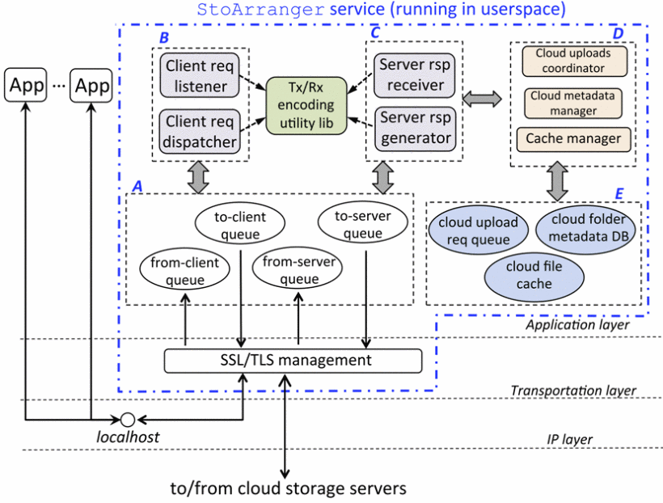
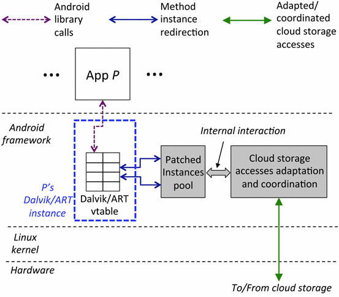

# StoArrager implementations

1. First One is based on proxy, please refer to [proxy-impl](proxy-impl/README.md) for more details

2. Second one is based on android runtime instruments, refer to [ddi-impl](ddi-impl/README.md) for more details

